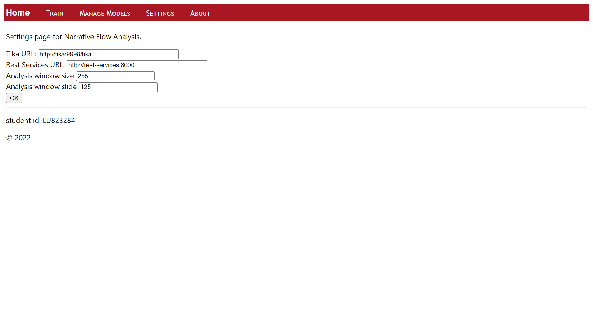

# The User Experience for the Narrtive Flow Analysis tool
The project acts at the user interface for the Narrative flow analysis tool 
## Instructions
### Configure Settings

## Train documents or csv file
http://server/train/ 
 

## Analyse a Document
 

## Manage a Model
http://manage/train/ 
 
## Settings
http://server/settings/ 

